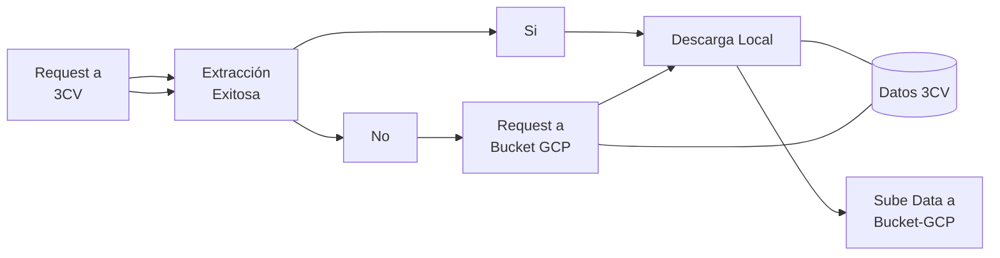

## Desarrollo de un ETL y dashboard con datos del 3CV
A continuación este es un primer proyecto que muestra alguno de los trabajos en los que he aportado.

### Objetivo
El objetivo es la creacion de un proceso de extraccion transformacion y carga de datos para ser utilizados con un dashboard que presente algunos analisis entorno a los datos. Los datos corresponden al [Centro de Control y Certificación Vehicular 3CV](https://www.subtrans.gob.cl/3cv/homologacion-de-vehiculos-livianos-medianos-y-motocicletas/) que son pruebas de homologación a vehículos nuevos que entran al mercado chileno. Estos datos han permitido realizar distintos avances legislativos y controles que han derivado en estratégias para descarbonizar, y mejorar la tecnología entrante al país. 

### Extracción de la data
El código de extracción puede encontrarse en *extraction.py*. La extracción consiste en el siguiente flujo de trabajo:

Basicamente se realiza una consulta a la [página del 3CV](https://www.subtrans.gob.cl/3cv/homologacion-de-vehiculos-livianos-medianos-y-motocicletas/) con las librerías [beautifulsoup4](https://pypi.org/project/beautifulsoup4/) y [requests](https://pypi.org/project/requests/). Paralelamente se configuro un bucket en [GCP](https://console.cloud.google.com/), de manera que si encuentra una base de datos, es descargada de forma local primero y posteriormente, actualiza la versión que se encuentra en el bucket de GCP. De esta forma, si en la página del 3CV no se encuentra la data, el sistema consulta luego al bucket y descarga una versión antigua. Una vez el archivo se encuentra actualizado y de forma local, comienza el proceso de transformación.

#### Configuración del Bucket en GCP
La creación de un bucket es bastante directo. No se utilizó ningún sistema de IoC porque no es necesario a este nivel. Se creó directamente el proyecto y en este se creó un bucket con nombre data/raw. En esta subcarpeta se alojará la data descargada sin transformaciones. Para la creación de credenciales, el proceso es una vez creado el bucket, se crea un correo de servicio. Posteriormente a este correo de servicio se agrega una credencial .json que debe ser descargada. Este archivo es guardado en una carpeta local que debe ser agregada al .gitignore para evitar 

