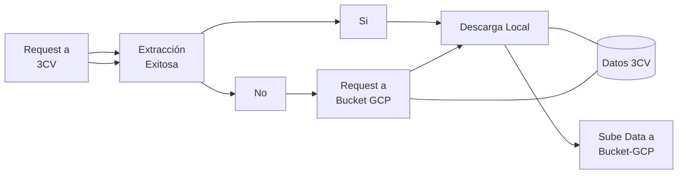
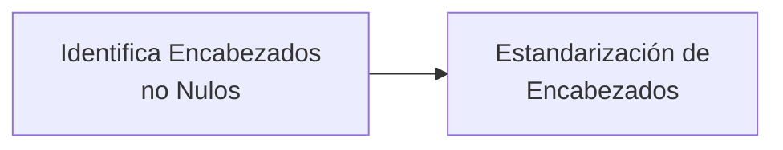

## Desarrollo de un ETL y dashboard con datos del 3CV

[Diagrama de ETL para datos del 3CV](/home/ariel/Escritorio/Proyectos Profesionales/1. Presentacion/portafolio/arielnunezsalinas.github.io/src/public/diagrams/isoflow-etl-dashboard-v2.png)

### Objetivo
El objetivo es la creacion de un proceso de extraccion transformacion y carga de datos para ser utilizados con un dashboard que presente algunos analisis entorno a los datos. Los datos corresponden al [Centro de Control y Certificación Vehicular 3CV](https://www.subtrans.gob.cl/3cv/homologacion-de-vehiculos-livianos-medianos-y-motocicletas/) que son pruebas de homologación a vehículos nuevos que entran al mercado chileno. Estos datos han permitido realizar distintos avances legislativos y controles que han derivado en estratégias para descarbonizar, y mejorar la tecnología entrante al país. 

### Extracción de la data
El código de extracción puede encontrarse en *extraction.py*. La extracción consiste en el siguiente flujo de trabajo:

```mermaid
flowchart LR
	3cvRequest[Request a
				3CV]
	statusData3cv[Extracción 
					Exitosa]
	boolTrue[Si]
	boolFalse[No]
	DescargaLocal[Descarga Local]
	BackUpBucket[Sube Data a 
					Bucket-GCP]
	ConsultaBucket[Request a 
				Bucket GCP]
	datos3cv@{shape: cyl, label: "Datos 3CV"}
	3cvRequest --> statusData3cv --> boolTrue
	3cvRequest --> statusData3cv --> boolFalse
	boolTrue --> DescargaLocal
	DescargaLocal --- datos3cv
	DescargaLocal --> BackUpBucket
	boolFalse --> ConsultaBucket 
	ConsultaBucket --> DescargaLocal
	ConsultaBucket --- datos3cv
```

Basicamente se realiza una consulta a la [página del 3CV](https://www.subtrans.gob.cl/3cv/homologacion-de-vehiculos-livianos-medianos-y-motocicletas/) con las librerías [beautifulsoup4](https://pypi.org/project/beautifulsoup4/) y [requests](https://pypi.org/project/requests/). Paralelamente se configuro un bucket en [GCP](https://console.cloud.google.com/), de manera que si encuentra una base de datos, es descargada de forma local primero y posteriormente, actualiza la versión que se encuentra en el bucket de GCP. De esta forma, si en la página del 3CV no se encuentra la data, el sistema consulta luego al bucket y descarga una versión antigua. Una vez el archivo se encuentra actualizado y de forma local, comienza el proceso de transformación.

#### Configuración del Bucket en GCP
La creación de un bucket es bastante directo. No se utilizó ningún sistema de IoC porque no es necesario a este nivel. Se creó directamente el proyecto y en este último, un bucket con nombre *data* que sub contiene *raw* y *processed*. En estas subcarpetas se alojaran la data descargada sin transformaciones y posteriormente transformada para ser servida a un dashboard construido en looker Studio. Se utilizó este último porque tiene integración directa con GCP. 

Para la creación de credenciales, se crea un correo de servicio para el proyecto. Posteriormente a este correo de servicio se agrega una credencial *.json* que debe ser descargada. Esta debe ser tratada como variable sensible.

### Transformación de la data
La data presentaba una estructura poco amigable para crear dashboards u otro tipo de automatizaciones. Principalmente porque los encabezados presentaban una visualización *pensada en excel*, más que pensada en una base de datos como tal. Por lo que se debieron hacer trasnformaciones estructurales de la data, identificar encabezados, estandarizarlos y posteriormente realizar transformaciones realizadas al tipo de dato, tratamiento de datos nulos y creación de otros encabezados.

```mermaid
flowchart LR
    identifyHeaders[Identifica Encabezados
                            no Nulos]
    transformHeaders[Estandarización de 
                        Encabezados]
    
    identifyHeaders --> transformHeaders
```

